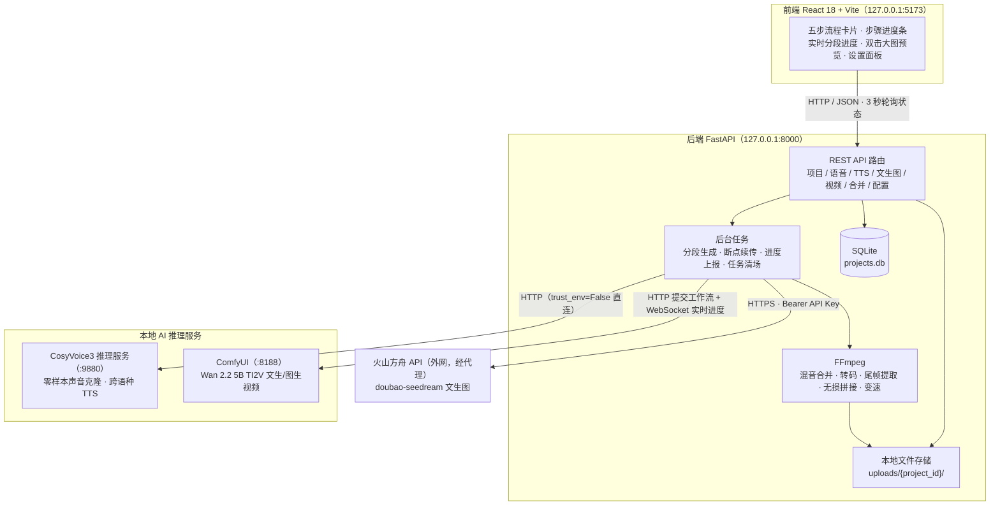
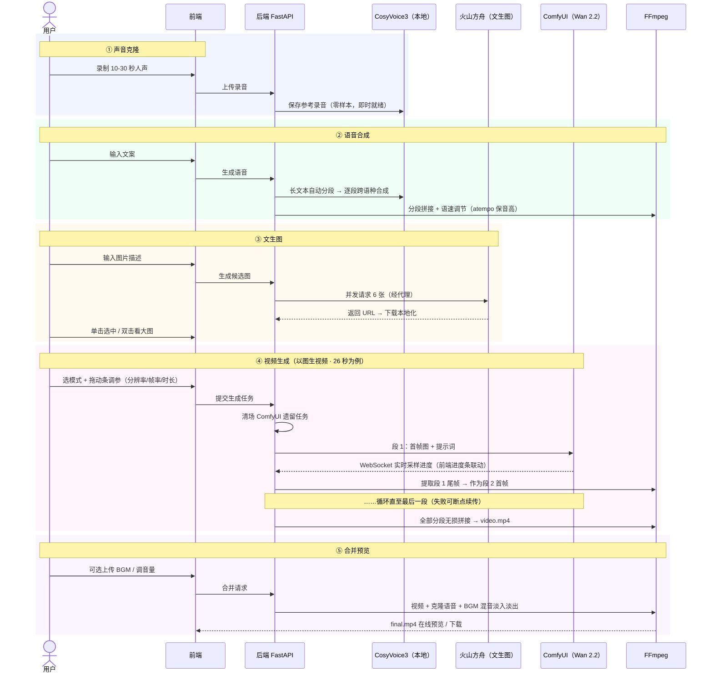

# 音视频克隆生成系统（CloneMPEG）

基于 **CosyVoice3 本地语音克隆 + 火山方舟文生图 + ComfyUI Wan 2.2 本地视频生成** 的 Web 端音视频生成系统。

录制一段自己的声音 → 输入文案生成配音 → 生成配图 → 生成长视频 → 合并为完整的"数字分身"视频，全流程在浏览器中完成。

## 功能特性

### 1. 声音克隆（本地零样本）
- 浏览器直接录制 10-30 秒人声，CosyVoice3 零样本克隆，**无需训练、即时可用**
- 内置多音色库（带 2 秒试听片段），克隆音色与内置音色统一选择，内置音色一览：
  | 音色 | 性别 | 风格 |
  |---|---|---|
  | 晓晓 | 女声 | 温柔 |
  | 晓伊 | 女声 | 甜美 |
  | 云希 | 男声 | 阳光 |
  | 云健 | 男声 | 浑厚 |
  | 云扬 | 男声 | 播音 |

### 2. 语音合成
- 使用克隆音色（或内置音色）朗读任意文案
- **长文本自动分段合成**（避免超长上下文内容丢失），逐段拼接
- 语速调节（FFmpeg atempo 变速不变调），共 7 档倍速：**0.5x 慢速 / 0.7x 较慢 / 1.0x 正常 / 1.2x 稍快 / 1.25x 略快 / 1.5x 较快 / 2.0x 快速**
- 语音库：历史合成记录可复用，跨项目一键选用

### 3. 文生图（火山方舟 doubao-seedream）
- 一次生成 **6 张候选图**，单击选中、**双击按原始比例查看大图**
- 一键重新生成，候选图本地化保存（不依赖临时 URL）

### 4. 视频生成（本地 ComfyUI · Wan 2.2 5B TI2V）
- 三种互斥模式：**文生视频（默认）/ 图生视频 / 上传本地视频**
- 分辨率（832×480 ~ 1280×704）、帧率（8-30fps）、时长（1-300 秒）拖动条调节
- **长视频自动分段**：按显存预算拆段 → 提取尾帧续写下一段（画面连贯）→ FFmpeg 无损拼接
- **WebSocket 实时进度**：段内采样百分比 + 总进度条
- **断点续传**：失败后已完成分段保留，同参数重试自动从失败段继续
- 遗留任务自动清场：新建项目 / 生成前自动中断残留任务，防止排队卡死

### 5. 合并预览
- 视频 + 克隆语音 + 可选 BGM 混音合成最终视频
- 音频超长智能检测（提示丢失时长，可确认强制截断）
- 在线预览与下载

### 6. 系统配置（Web 设置面板）
- 大模型 API Key、服务地址、超时、演示模式等全部可在线修改
- API Key 仅显示掩码，完整密钥永不下发；保存即写 `.env` 并即时生效

## 系统架构



**架构要点**

- **产物全本地化**：录音、音频、图片、视频全部落盘 `uploads/{project_id}/`，不依赖云端临时 URL
- **异步任务 + 状态机**：各阶段 `pending → generating → ready/failed`，前端轮询展示；后端重启自动恢复中断任务状态
- **本地服务直连**：所有 127.0.0.1 调用禁用环境代理（`trust_env=False`），仅外网 API 走代理
- **显存预算自适应**：按"像素×帧数"预算自动限制单段帧数（85% 安全系数），低分辨率自动允许更长单段

## 主流程演示



## 技术栈

| 层 | 技术 |
|---|---|
| 前端 | React 18 · Vite |
| 后端 | Python 3.11 · FastAPI · Uvicorn · SQLAlchemy（异步 SQLite） |
| 多媒体 | FFmpeg（合并 / 转码 / 拼接 / 尾帧提取 / 变速） |
| 语音 | CosyVoice3（本地零样本克隆 + 跨语种 TTS） |
| 文生图 | 火山方舟 doubao-seedream（外部 API，经代理） |
| 视频 | ComfyUI + Wan 2.2 5B TI2V（本地 GPU 推理） |

## 环境准备

### 前置依赖

1. [conda](https://docs.conda.io/)、[Node.js](https://nodejs.org/)、[FFmpeg](https://ffmpeg.org/)（确保在 PATH 中）
2. NVIDIA GPU（视频生成需要；本项目在 RTX 2080 Ti 22GB 上验证）

### 三个 conda 环境

| 环境 | 用途 | 安装 |
|---|---|---|
| `av-clone` | 后端 FastAPI | `pip install -r backend/requirements.txt` |
| `cosyvoice` | CosyVoice3 推理服务 | `pip install -r cosyvoice_service/requirements_runtime.txt` |
| `comfyui` | ComfyUI 视频生成 | ComfyUI 源码放入 `third_party_ComfyUI/`，依赖安装到其 `.pydeps` |

> CosyVoice3 模型通过 `scripts/download_model.py` 从 ModelScope 下载；ComfyUI 的 Wan 2.2 模型（`wan2.2_ti2v_5B_fp16` / `umt5_xxl_fp8` / `wan2.2_vae`）请自行放入其 models 目录。两个第三方目录体积巨大，**不在本仓库内**，需自行部署。

### 配置

复制 `backend/.env.example` 为 `backend/.env`，填写火山引擎 API Key：

```env
# 火山引擎方舟 API Key（文生图，必填；也可启动后在「设置」面板中填写）
ARK_API_KEY=your_ark_api_key

# 本地代理（访问火山引擎，按网络环境调整；无代理可留空）
HTTP_PROXY=http://127.0.0.1:7890
```

其余配置（ComfyUI / CosyVoice 地址、超时、演示模式等）均有默认值，可在前端「设置」面板中在线修改。

## 快速启动

```bash
# 一键启动全部服务（后端 / CosyVoice / ComfyUI / 前端，已运行的自动跳过）
<av-clone 环境的 python 路径> start_all.py
```

或分别手动启动：

```bash
# 后端（终端 1）
cd backend && conda activate av-clone
uvicorn app.main:app --host 127.0.0.1 --port 8000

# CosyVoice 推理服务（终端 2）
cd cosyvoice_service && conda activate cosyvoice
python server.py --host 127.0.0.1 --port 9880

# ComfyUI（终端 3）
cd third_party_ComfyUI && conda activate comfyui
$env:PYTHONPATH=".pydeps"; python main.py --listen 127.0.0.1 --port 8188

# 前端（终端 4）
cd frontend && npm install && npm run dev
```

打开 **http://127.0.0.1:5173** 即可使用。后端 API 文档：http://127.0.0.1:8000/docs

## 运行测试

```bash
cd backend && conda activate av-clone
pytest tests/ -v
```

覆盖：项目 CRUD、配置管理（掩码/持久化/注入防护）、文件存储、FFmpeg 合并、音频超长拦截、视频分段断点续传与 WebSocket 消息解析等。

## 安全注意事项

- **仅限本地使用**：所有服务只绑定 `127.0.0.1`，API 无鉴权，请勿暴露到公网
- **密钥保护**：API Key 仅存于 `backend/.env`（已被 `.gitignore` 排除），查询接口只返回掩码
- **隐私数据**：`uploads/` 保存用户录音与生成产物，已被 `.gitignore` 排除，不会随仓库上传
